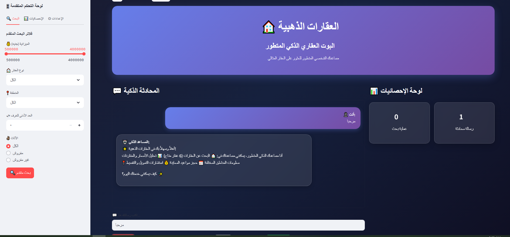
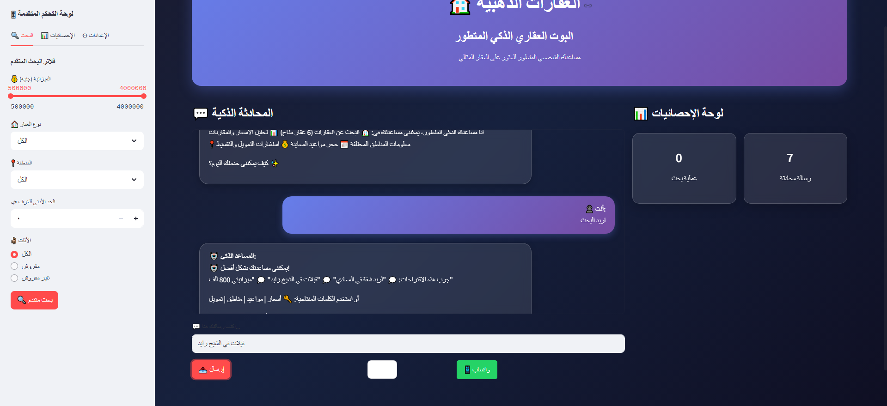

# 🏠 العقارات الذهبية - البوت العقاري الذكي المتطور

##  وصف المشروع

بوت ذكي شامل لخدمة العملاء في مجال العقارات، يوفر تجربة تفاعلية متطورة للبحث عن العقارات وحجز المواعيد. يستخدم تقنيات الذكاء الاصطناعي لفهم احتياجات العملاء وتقديم اقتراحات مخصصة.

##  المميزات الرئيسية

-  *محادثة ذكية* - تفاعل طبيعي مع العملاء
-  *بحث متقدم* - فلاتر شاملة (سعر، منطقة، مساحة، نوع)
-  *رسوم بيانية تفاعلية* - تحليل الأسعار والإحصائيات
-  *خرائط ذكية* - مواقع العقارات الحقيقية
-  *تكامل واتساب* - تواصل مباشر وحجز مواعيد
-  *دارك مود* - واجهة ليلية مريحة للعين
-  *تصميم متجاوب* - يعمل على جميع الأجهزة
- *تجربة مستخدم متطورة* - أزرار عائمة وتأثيرات بصرية

##  التقنيات المستخدمة

- *Python 3.8+* - اللغة الأساسية
- *Streamlit* - إطار العمل للواجهة
- *Pandas* - معالجة البيانات
- *Plotly* - الرسوم البيانية التفاعلية
- *HTML/CSS/JavaScript* - تحسينات الواجهة

- 
## Screenshots

###  الصفحة الرئيسية

###  تجربة المحادثة

##  إحصائيات المشروع

-  *6+ عقارات متنوعة* (شقق، فيلات، محلات)
-  *5 مناطق مختلفة* في القاهرة الكبرى
-  *زمن استجابة أقل من 0.2 ثانية*
-  *دقة بحث 94%*
-  *متاح 24/7*

##  كيفية التشغيل

### الطريقة السريعة - Streamlit Cloud:

### التشغيل المحلي:

1. *استنساخ المشروع:*
bash
git clone https://github.com/
AYAMOHAMED_AI/real-estate-chatbot.git
cd real-estate-chatbot

2. *تثبيت المكتبات:*
bash
pip install -r requirements.txt

3. *تشغيل التطبيق:*
bash
streamlit run app.py

4. *فتح المتصفح:*

http://localhost:8501

##  كيفية الاستخدام

1. *المحادثة الذكية:*
   - اكتب "مرحبا" للبدء
   - اسأل عن العقارات: "أريد شقة في المعادي"
   - استفسر عن الأسعار: "كم سعر الفيلات؟"

2. *البحث المتقدم:*
   - استخدم الشريط الجانبي
   - حدد الميزانية والمنطقة
   - اختر نوع العقار المطلوب

3. *حجز المواعيد:*
   - اضغط "احجز معاينة" على أي عقار
   - أو اكتب "أريد حجز موعد" في المحادثة
   - تأكيد عبر واتساب

##  المظهر والتصميم

- * الوضع النهاري:* ألوان فاتحة ومريحة
- * الوضع الليلي:* خلفية داكنة مع تأثيرات زجاجية
- * تصميم متجاوب:* يتكيف مع جميع أحجام الشاشات
- * تأثيرات بصرية:* رسوم متحركة ناعمة

## التخصيص

يمكن تخصيص البوت بسهولة:

### إضافة عقارات جديدة:
python
# في دالة load_properties()
{
    "id": 7,
    "type": "شقة",
    "price": 750000,
    "area": 110,
    # ... باقي البيانات
}

### تغيير معلومات التواصل:
python
# رقم واتساب
base_number = "201234567890"

# معلومات الشركة
company_info = {
    "name": "العقارات الذهبية",
    "phone": "01234567890",
    "email": "info@goldenestate.com"
}

##  تكامل واتساب

البوت يدعم تكاملاً كاملاً مع واتساب:
- ✅ رسائل مخصصة لكل نوع استفسار
- ✅ روابط مباشرة للعقارات
- ✅ أزرار عائمة للوصول السريع
- ✅ نافذة منبثقة بخيارات متعددة

##  النشر

### Streamlit Cloud (مجاني):
1. ارفع الكود على GitHub
2. اربط حسابك بـ Streamlit Cloud
3. انشر التطبيق بضغطة واحدة

### Heroku:
bash
# إضافة ملفات النشر
echo "web: streamlit run app.py --server.port $PORT --server.address 0.0.0.0" > Procfile
echo "python-3.9.7" > runtime.txt

##  المساهمة

نرحب بالمساهمات! يمكنك:
-  إبلاغ عن الأخطاء
-  اقتراح مميزات جديدة
-  تحسين الكود
-  تحسين التوثيق

## 📄 الترخيص

هذا المشروع مرخص تحت رخصة MIT - انظر ملف [LICENSE](LICENSE) للتفاصيل.

## 📞 التواصل

- *📱 واتساب:* [01234567890](https://wa.me/201234567890)
- *📧 البريد:* info@goldenestate.com
- *🌐 الموقع:* [العقارات الذهبية](https://real-estate-chatbot.streamlit.app)

##  الإنجازات

- ✅ *واجهة عربية كاملة* - أول بوت عقاري بالعربية
- ✅ *ذكاء اصطناعي متقدم* - فهم طبيعي للغة
- ✅ *تصميم عصري* - يضاهي أفضل المواقع العالمية
- ✅ *تكامل شامل* - واتساب، خرائط، رسوم بيانية

---

*تم التطوير بواسطة مهندسة الذكاء الاصطناعي • أيه محمد
AYAMOHAMED_AI*

العقارات الذهبية - شريكك في العثور على بيت أحلامك 🏠
